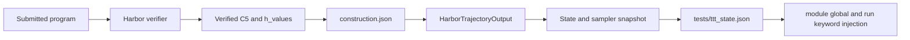

# Harbor TTT parity fix

## Goal

Make the Harbor-based TTT loop reproduce the search and learning semantics of
the reference `ttt-discover` Erdős run while retaining Harbor as the execution
environment.

The most important parity requirement is that a search state is the **verified
construction**, not merely the Python program that happened to produce it. A
program can be stochastic or time-dependent. Replaying the same source does not
guarantee the same `h_values`, whereas passing the verified `h_values` to the
next rollout lets the model refine the exact best result.

This document separates optimization-parity bugs from checkpoint-service bugs.
The Tinker checkpoint `409 already exists` issue is a checkpoint idempotency
problem; it can crash or disrupt resume, but it does not explain the search
plateau inside Harbor.

## Executive summary

Implement these changes in this order:

1. Preserve the verifier-approved `h_values` end to end and inject them into
   every child trial as `initial_h_values`.
2. Keep the policy-training reward separate from the PUCT state value:
   `reward = 1 / (1e-8 + C5)` and `State.value = -C5`.
3. Add the reference `entropic_adaptive_beta` estimator and select it in the
   launcher.
4. Match reference PUCT accounting, construction-based deduplication, scale,
   top-k retention, and diversified batch selection.
5. Add a strict parity launch profile for group geometry, KL regularization,
   synchronous updates, and timeouts. Re-enable Harbor-specific performance
   features only after the parity test passes.

The first item was the main functional bug: Harbor kept the submitted program
and scalar reward but discarded the best numerical construction returned by
that program. The construction transport, search-value separation, adaptive
beta estimator, construction deduplication, and core PUCT accounting described
below are now implemented. Full experimental parity is not yet claimed because
the launcher still uses reduced group geometry, fully asynchronous updates, and
no reference KL transform.

Implementation note: adaptive beta is registered in
`entrypoints/main_harbor.py`; `harbor_generator_ttt.py` owns rollout and search
artifact transport, not advantage estimation.

## Reference and Harbor locations

Reference implementation:

- `discover/examples/erdos_min_overlap/env.py`
- `discover/ttt_discover/discovery.py`
- `discover/ttt_discover/rl/train.py`
- `discover/ttt_discover/tinker_utils/dataset_builder.py`
- `discover/ttt_discover/tinker_utils/sampler.py`

Harbor implementation:

- `open_discovery/SkyRL/examples/train_integrations/harbor/ttt/state.py`
- `open_discovery/SkyRL/examples/train_integrations/harbor/ttt/sampler.py`
- `open_discovery/SkyRL/examples/train_integrations/harbor/harbor_generator_ttt.py`
- `open_discovery/SkyRL/examples/train_integrations/harbor/entrypoints/main_harbor.py`
- `open_discovery/harbor_tasks/ttt_harbor_erdos/erdos/tests/verifier.py`
- `open_discovery/harbor_tasks/ttt_harbor_erdos/erdos/prompt_context.json`
- `open_discovery/scripts/test_rl_harbor_ttt_sqfs.sh`

## Construction transport (implemented)



`metrics.json` intentionally remains small. The separately validated
`construction.json` carries the normalized vector, and malformed or missing
construction artifacts are rejected as child states for tasks with
`CONSTRUCTION_REQUIRED=true`.

## Parity matrix

| Behavior | Reference `ttt-discover` | Current Harbor TTT | Required fix |
|---|---|---|---|
| Search artifact | Stores `result_construction=list(h_values)` | Implemented via `construction.json` | Done |
| Child initialization | Defines `initial_h_values` from parent construction | Injected as module global and accepted run keyword | Done |
| Training reward | `1 / (1e-8 + C5)` | Reciprocal verifier reward | Done |
| PUCT/state value | `-C5` | Derived from `PERFORMANCE_MODE=minimize` | Done |
| Advantage | `entropic_adaptive_beta`, target KL `log(2)` | Registered and selected by launcher | Done |
| Deduplication | Construction tuple, source fallback | Exact float64 construction hash, source fallback | Done |
| PUCT scale floor | `1e-6` | Configurable, launcher uses `1e-6` | Done |
| PUCT accounting | One update per distinct sampled parent; best child return | Parent-aggregated | Done |
| Value backup | Best return in immediate parent `_m`; visits on its ancestry | Matched | Done |
| Batch selection | Blocks the selected state's full lineage | Matched with virtual-visit backfill | Done |
| Retained children | Top 2 per parent | Launcher and PUCT default use 2 | Done |
| Initial archive | Eight independently randomized construction states | Eight fallback lineages, still constant seed construction | Remaining |
| Batch geometry | 8 groups x 64 rollouts | Configured as 8 samples/prompt and batch 64 | Add parity profile: 8 groups x 64 |
| KL | Centered per-token base-policy KL contribution, coefficient `0.1` | Disabled | Port exact behavior or explicitly test a documented approximation |
| Scheduling | Synchronous update | Fully async, staleness up to 4 | Disable async in parity profile |
| Failure filtering | Removes failed samples and constant-reward groups | One failed rollout masks the whole prompt group | Resample/drop the failed member without losing successful siblings |
| Timeouts | 1000 s program budget, 1100 s execution, 8000 s outer grading wait | 1000 s agent, 1015 s execution, 1030 s verifier | Separate program, execution, verifier, and queue watchdogs |

## 1. Preserve and pass the verified construction

### Verifier artifact

After independent validation, write an atomic artifact next to `metrics.json`:

```json
{
  "schema_version": 1,
  "kind": "erdos_h_values",
  "metric": "c5_bound",
  "mode": "minimize",
  "objective_value": 0.3808,
  "selection_value": -0.3808,
  "training_reward": 2.626050,
  "n_points": 96,
  "construction": [0.1, 0.2, 0.3]
}
```

Use `/logs/verifier/construction.json`. Only write it after validation succeeds,
and serialize the normalized float64 vector that was actually validated, not the
untrusted raw return value. Keep `metrics.json` small so ordinary metrics and log
parsers are not flooded with a long vector.

If necessary, split `verify_c5_solution` into an internal function that returns
both `(verified_h_values, computed_c5)` and a public compatibility wrapper that
continues to return only the score. This avoids changing the validator source
shown to the model.

### Generator transport

Extend `HarborTrajectoryOutput` with:

```python
construction: list[float] | None = None
selection_value: float | None = None
```

In `_harbor_agent_loop`, read
`<trial>/verifier/construction.json`, validate its schema and finiteness, and
attach it to the trajectory output. A missing or malformed artifact must not be
treated as a valid child state.

When building the child, use:

```python
child = parent.make_child(
    solution=solution,
    value=result.selection_value,
    construction=result.construction,
    ...,
)
```

The rollout's `result.reward` remains the policy-training reward. Do not assign
it to `State.value`.

### State and snapshot schema

`State` now includes `construction: list[float] | None = None` in `initial`,
`make_child`, `to_dict`, and `from_dict`. The sampler snapshot schema is version
2, while old source-only snapshots load with `construction=None`.

Every materialized state task should contain a task-private file such as
`tests/ttt_state.json`:

```json
{
  "schema_version": 1,
  "kind": "verified_construction",
  "construction": [0.1, 0.2, 0.3]
}
```

Write this file from `State.make_child` after copying the task directory. Always
overwrite any inherited copy so a grandchild cannot accidentally receive a
stale ancestor construction.

### Task-specific verifier injection

The submitted program is forbidden from doing filesystem I/O, so each task's
verifier adapter must load the generic `construction` from
`tests/ttt_state.json` and expose a fresh copy using that task's domain API.
For Erdős specifically, immediately before calling `run`:

1. Set `submitted_module.initial_h_values = values.copy()`.
2. Pass `initial_h_values=values.copy()` when `run` explicitly accepts that
   parameter or has `**kwargs`.
3. Continue to pass `seed=42` and `budget_s=1000`.

Supporting both the module global and keyword forms makes old and new generated
programs work. Use a new copy for each execution so in-place optimization cannot
mutate the stored parent state.

The prompt should state that `initial_h_values` is the exact verified parent
construction, should be copied before mutation, and must not be replaced by a
random initialization when present.

## 2. Separate objective, selection value, and training reward

These three quantities have different jobs:

| Quantity | Erdős definition | Consumer |
|---|---:|---|
| Raw objective | `C5` | Reporting and validation |
| Search value | `-C5` | PUCT, archive sorting, parent/child comparisons |
| Training reward | `1 / (1e-8 + C5)` | Adaptive entropic advantages and policy update |

Add `PERFORMANCE_MODE: "minimize"` to `prompt_context.json`. The generator should
read `PERFORMANCE_METRIC` and `PERFORMANCE_MODE`, then derive a higher-is-better
selection value from the verified raw metric. For a minimizing task, use
`-raw_value`; for a maximizing task, use `raw_value`.

This preserves generic Harbor TTT behavior across datasets without teaching the
sampler that Erdős is special. The verifier remains the authority for the
training reward.

The task's `VALUE_CONTEXT` now distinguishes reciprocal policy reward from the
negative-C5 search value.

## 3. Port adaptive entropic advantages exactly

Register `entropic_adaptive_beta` in `main_harbor.py` using the reference
algorithm in `discover/ttt_discover/rl/train.py`:

1. For each reward group, solve for `beta >= 0` such that
   `KL(softmax(beta * reward) || uniform) = log(2)`.
2. Use exponential bracketing up to `beta_max=1e6` and 60 binary-search
   iterations.
3. Compute stable exponentials from `beta * (r - max(r))`.
4. Compute the leave-one-out normalizer
   `Z_i = (sum_j e_j - e_i) / (k - 1)`.
5. Return `advantage_i = e_i / (Z_i + 1e-12) - 1`.
6. A singleton group gets zero advantage.

Do not divide the final advantage by beta. Preserve SkyRL's response mask and
grouping rules. Log beta, achieved KL, reward range, and advantage range per
batch so a constant or mis-grouped batch is immediately visible.

Set the launcher to:

```text
trainer.algorithm.advantage_estimator="entropic_adaptive_beta"
```

Fixed beta is especially ineffective for Erdős because improvements in `C5`
are often only `1e-5` to `1e-4`; a fixed beta of 2 makes those rollouts nearly
indistinguishable.

## 4. Match reference PUCT semantics

### Construction-first deduplication

Change the sampler key to:

1. `(task_key, canonical_construction_hash)` when construction exists.
2. `(task_key, solution_hash)` only as a legacy/source-only fallback.

Canonicalize to a one-dimensional float64 array, require finite values, and hash
its shape plus bytes. Do not round for the first parity implementation. Exact
rounding can merge genuinely distinct optimized states.

This deliberately treats the following cases differently from the current
implementation:

- Same source, different stochastic constructions: keep both.
- Different source, identical construction: keep one.

### PUCT score

Match the reference equation directly:

```text
score(i) = Q(i) + c * scale * P(i) * sqrt(1 + T) / (1 + n[i])
scale    = max(max(value) - min(value), 1e-6)
Q(i)     = m[i] if n[i] > 0 else value[i]
```

Remove Harbor's `T / group_size` and `n / group_size` normalization once updates
are aggregated per parent. Make the scale floor configurable and set the parity
default to `1e-6`; `0.01` overwhelms the objective differences seen in this
task.

### Backup accounting

For one completed generation batch:

1. Group valid children by immediate parent ID.
2. Compute only the best child selection value for each distinct parent.
3. Update `_m[parent_id]` with that best return.
4. Increment `_n` once for the immediate parent and each ancestor.
5. Increment `_T` once per distinct parent, not once per child rollout.

Do not write the child return into `_m` for every ancestor. The reference backs
up visit counts through the ancestry but keeps `_m` on the immediate sampled
parent.

### Diversified parent selection

Calling deterministic `_pick` repeatedly returns the same parent for every
same-task group. Port the reference batch selection:

1. Score all candidates once.
2. Select the highest-scoring candidate.
3. Block its full ancestor-and-descendant lineage for the rest of that batch.
4. Continue until the requested number of parents is selected.

If the archive has too few independent lineages, backfill explicitly using
virtual visits and log the fallback. Never silently return a smaller batch.

Set `topk_children=2`, preserve initial states during archive truncation, and
save `initial_states`, `_n`, `_m`, and `_T` in every sampler snapshot.

## 5. Initial states and batch geometry

The reference starts with eight random constructions of 40--99 points, centered
around 0.5 with mean-zero uniform perturbations, and assigns each state
`value=-C5`. Harbor currently repeats a constant 200-point, all-0.5 seed
program.

For reproducible, task-independent plumbing, let a Harbor task optionally ship
`initial_states.json` containing serialized state artifacts. The Erdős task
should contain eight pre-generated constructions using the reference recipe.
`State.initial` should select one based on the prompt-group index and materialize
it as `tests/ttt_state.json`. Record generation seeds in the artifact.

The reference optimization batch is 8 parent groups x 64 candidates = 512
rollouts per step. The current launcher uses 8 samples per prompt and a training
batch size of 64, which is not equivalent. Add a parity profile with 64 samples
per prompt and eight parent groups. Instrument and log the actual number of
groups, candidates per group, and valid candidates before relying on the
configured values.

This profile will be slower. Keep a separate reduced-throughput smoke profile;
do not call the smoke profile algorithmically equivalent.

## 6. KL, scheduling, failures, and timeouts

### KL regularization

The reference uses a centered per-token base-policy log-probability contribution
with coefficient `0.1`. SkyRL's generic KL-in-reward and KL-loss switches are
not automatically identical to this computation. Exact parity requires a small
custom post-advantage transform matching
`discover/ttt_discover/rl/train.py::incorporate_kl_penalty`.

Until that is implemented, leave the approximation clearly labeled in metrics.
Do not leave KL silently disabled in a run advertised as parity.

### Synchronous parity profile

The published reference loop is synchronous. For the parity experiment, use the
synchronous Harbor entrypoint or set effective staleness to zero. Fully async
training with `max_staleness_steps=4` remains a valid throughput experiment, but
it changes which policy generated each construction and is a separate ablation.

### Failed rollouts

`build_step_wise_generator_output` currently masks every sibling in a prompt
group when one rollout fails. Prefer resampling the failed member. If resampling
is not possible, exclude only failed trajectories and then remove
constant-reward groups. If SkyRL requires a rectangular group, pad with a
loss-masked element after advantage computation rather than discarding valid
siblings.

### Timeouts

Use distinct timeout layers:

- Submitted program budget: 1000 s.
- Program hard-execution timeout: at least 1100 s.
- Harbor verifier timeout: execution timeout plus startup/serialization margin.
- Outer queue-inclusive grading watchdog: about 8000 s, as in the reference.

An agent timeout of exactly 1000 s can terminate the whole Harbor interaction
before a 1000 s submitted program plus model/tool overhead completes. The agent
timeout must cover the interaction, not mirror the inner program budget.

## 7. Resume and migration

Use a versioned sampler schema. New snapshots should include:

```json
{
  "schema_version": 2,
  "step": 18,
  "states": [],
  "initial_states": [],
  "puct_n": {},
  "puct_m": {},
  "puct_T": 0
}
```

Each serialized state contains its construction. Resume must restore the trainer
checkpoint and sampler snapshot at the same logical step.

Legacy Harbor snapshots can load with `construction=None` and source-based
deduplication. They cannot recover an exact historical `h_values` vector that
was never persisted. If the corresponding trial directory still contains a new
construction artifact, a one-time migration may attach it; otherwise the resume
is source-only and should be labeled as such.

Do not infer a missing sampler step by silently starting from step zero. Fail
with the expected path and list the available sampler snapshots.

## 8. Tests

Add unit tests under `open_discovery/SkyRL/tests/train/generators/` and verifier
tests under the Erdős Harbor task.

Required tests:

1. **Artifact round trip:** validated `h_values` survive verifier JSON,
   `HarborTrajectoryOutput`, `State`, and sampler snapshot serialization exactly.
2. **Injection:** programs using a module-global variable, an explicit keyword,
   or `**kwargs` receive the same copied parent construction.
3. **No mutation leak:** a child that mutates `initial_h_values` cannot change
   the parent snapshot.
4. **Dedup semantics:** same source/different construction is retained;
   different source/same construction is deduplicated.
5. **PUCT fixture:** fixed candidates produce the same selected IDs, `_n`, `_m`,
   and `_T` as the reference sampler for several updates.
6. **Batch diversity:** independent lineages are selected before a lineage is
   reused.
7. **Adaptive beta:** achieved KL is close to `log(2)` when attainable, rewards
   shifted by a constant produce identical advantages, and constant rewards
   produce zero advantages.
8. **Reward separation:** the policy receives reciprocal reward while the
   sampler receives `-C5`.
9. **Legacy resume:** a schema-v1/source-only snapshot loads without pretending
   it contains a construction.
10. **Two-step integration:** step N saves a known construction and step N+1
    demonstrably receives its exact values.

## 9. Acceptance criteria

The parity fix is complete when all of the following hold:

- Every valid Erdős child in the sampler snapshot has a finite construction and
  a `State.value` equal to negative independently verified `C5`.
- A known construction hash from step N is present in at least one step N+1
  trial's injected state artifact.
- PUCT does not choose the same lineage for all eight parent groups when eight
  independent lineages are available.
- Sampler deduplication is based on the verified construction, with source only
  as a documented fallback.
- Training logs report adaptive beta, achieved entropic KL, reward range,
  advantage range, valid group count, and PUCT scale.
- The parity launcher uses adaptive beta, top-2 children, the `1e-6` PUCT scale
  floor, reciprocal training reward, `-C5` search values, and no policy
  staleness.
- Checkpoint resume restores both training and sampler state at the same step
  without overwriting or silently restarting either side.

## Suggested implementation sequence

### Phase A: unblock real state refinement

- Add construction artifact writing and reading.
- Add `State.construction` serialization and child materialization.
- Inject `initial_h_values` in the verifier runner.
- Add the two-step integration test.

### Phase B: restore search semantics

- Separate search value from training reward.
- Switch to construction-based deduplication.
- Port exact PUCT score, backup, diversity, scale, and top-k behavior.
- Add initial-state archive persistence.

### Phase C: restore learning semantics

- Port `entropic_adaptive_beta`.
- Match group geometry and constant-group handling.
- Port the reference KL contribution.
- Run synchronously for the parity experiment.

### Phase D: performance ablations

- Re-enable fully async execution.
- Reduce group size if required for throughput.
- Compare each change independently against the parity profile so speedups are
  not confused with algorithm changes.
